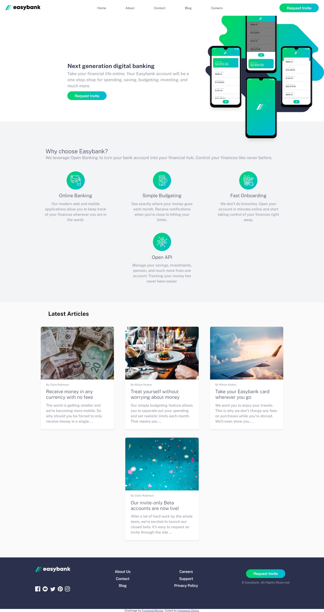

# Frontend Mentor - Easybank landing page solution

This is a solution to the
[Easybank landing page challenge on Frontend Mentor](https://www.frontendmentor.io/challenges/easybank-landing-page-WaUhkoDN).
Frontend Mentor challenges help you improve your coding skills by building
realistic projects.

## Table of contents

- [Overview](#overview)
  - [The challenge](#the-challenge)
  - [Screenshot](#screenshot)
  - [Links](#links)
- [My process](#my-process)
  - [Built with](#built-with)
  - [What I learned](#what-i-learned)
  - [Continued development](#continued-development)
  - [Useful resources](#useful-resources)
- [Author](#author)
- [Acknowledgments](#acknowledgments)

**Note: Delete this note and update the table of contents based on what sections
you keep.**

## Overview

### The challenge

Users should be able to:

- View the optimal layout for the site depending on their device's screen size
- See hover states for all interactive elements on the page

### Screenshot

Add a screenshot of your solution. The easiest way to do this is to use Firefox
to view your project, right-click the page and select "Take a Screenshot". You
can choose either a full-height screenshot or a cropped one based on how long
the page is. If it's very long, it might be best to crop it.

Alternatively, you can use a tool like [FireShot](https://getfireshot.com/) to
take the screenshot. FireShot has a free option, so you don't need to purchase
it.

Then crop/optimize/edit your image however you like, add it to your project, and
update the file path in the image above.

**Note: Delete this note and the paragraphs above when you add your screenshot.
If you prefer not to add a screenshot, feel free to remove this entire
section.**

### Links

- Solution URL: [Add solution URL here](https://your-solution-url.com)
- Live Site URL: [Add live site URL here](https://your-live-site-url.com)

## My process

started with mobile first approach when design the main page of the website but
took the desktop approach when designing the mobile navigation

### Built with

- Semantic HTML5 markup
- CSS custom properties
- Flexbox
- CSS Grid
- Mobile-first workflow -SASS For styles

**Note: These are just examples. Delete this note and replace the list above
with your own choices**

### What I learned

i learnt how to use the object fit property and understand how it works also
sharpened my skill on building a navigation bar by learing a few tricks(i know
right kind of funny 😂 that i never really understood how the DOM worked😥
mostly relied on codes on the web or bootstrap components 😪 to do that) i also
learnt how to access an event with the target property to close the mobile
navigation if the event.target is the overlay😎. Also added some minute
animation on the navigation links in the mobile menu.

### Continued development
I would love to add some  animations to some sections  as the page loads up.("When i have more time 🥱")
### Useful resources

## Author

- Frontend Mentor -
  [@yourusername](https://www.frontendmentor.io/profile/yourusername)

## Acknowledgments

This is where you can give a hat tip to anyone who helped you out on this
project. Perhaps you worked in a team or got some inspiration from someone
else's solution. This is the perfect place to give them some credit.

**Note: Delete this note and edit this section's content as necessary. If you
completed this challenge by yourself, feel free to delete this section
entirely.**
