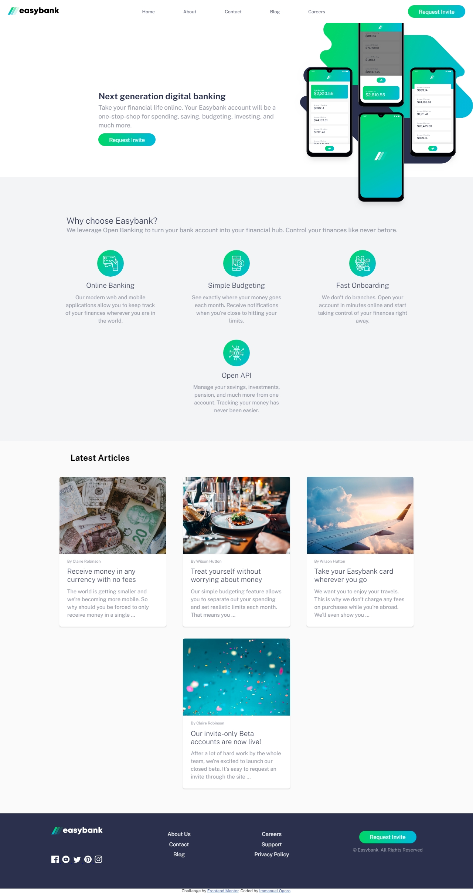

# Frontend Mentor - Easybank landing page solution

This is a solution to the
[Easybank landing page challenge on Frontend Mentor](https://www.frontendmentor.io/challenges/easybank-landing-page-WaUhkoDN).
Frontend Mentor challenges help you improve your coding skills by building realistic projects.

## Table of contents

- [Overview](#overview)
  - [The challenge](#the-challenge)
  - [Screenshot](#screenshot)
  - [Links](#links)
- [My process](#my-process)
  - [Built with](#built-with)
  - [What I learned](#what-i-learned)
  - [Continued development](#continued-development)
  - [Useful resources](#useful-resources)
- [Author](#author)
- [Acknowledgments](#acknowledgments)

**Note: Delete this note and update the table of contents based on what sections you keep.**

## Overview

### The challenge

Users should be able to:

- View the optimal layout for the site depending on their device's screen size
- See hover states for all interactive elements on the page

### Screenshot

### Links

- Solution URL: [Add solution URL here](https://your-solution-url.com)
- Live Site URL: [Add live site URL here](https://your-live-site-url.com)

## My process

started with mobile first approach when design the main page of the website but took the desktop approach when designing
the mobile navigation

### Built with

- Semantic HTML5 markup
- CSS custom properties
- Flexbox
- CSS Grid
- Mobile-first workflow -SASS For styles -Responsive web design in mind

### What I learned

i learnt how to use the object fit property and understand how it works also sharpened my skill on building a navigation
bar by learing a few tricks(i know right kind of funny 😂 that i never really understood how the DOM worked😥 mostly
relied on codes on the web or bootstrap components 😪 to do that) i also learnt how to access an event with the target
property to close the mobile navigation if the event.target is the overlay😎. Also added some minute animation on the
navigation links in the mobile menu and also a little helper that allow you to close the mobile menu by just clicking on
any part of the document(mobile though)

### Continued development

I would love to add some animations to some sections as the page loads up.("When i have more time 🥱")

### Useful resources

I'll recommend that before you take this challenge you have an idea of the object fit property know about pseudo classes
in css and how to use the overflow propery and the background size property

## Author

- Frontend Mentor - [@yourusername](https://www.frontendmentor.io/profile/yourusername)
